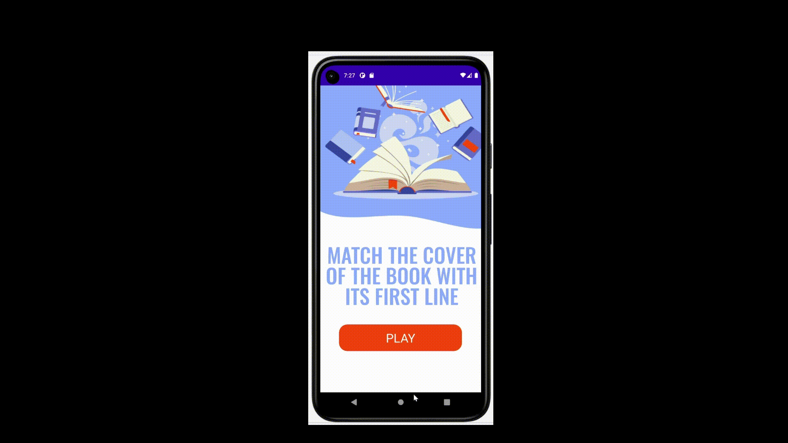

# Android App Quiz (приложение квиз)

## 1. Основная идея
Мобильное Android приложение App Quiz, реализующее викторину по книгам. 

## 2. Использование проекта
### 2.1 Быстрый старт 

```
Скачайте Android Studio->загрузите zip-файл или папку git clone'Qiuz'-> Откройте проект с помощью Android Studio-> подключитесь к своему телефону для компиляции с помощью USB
```

### 2.2 Демонстрация работы приложения
После запуска приложения открывается его главная страница, которая содержит кнопку для старта квиза.

Далее запускается сама викторина, на каждый вопрос отводится 15 секунд.  А после отображается правильное количество баллов, набранных за игру, которыми можно поделиться с помощью специальной кнопки.



Если на вопрос за 15 секунд не дан ответ, то всплывает окно с ошибкой.


